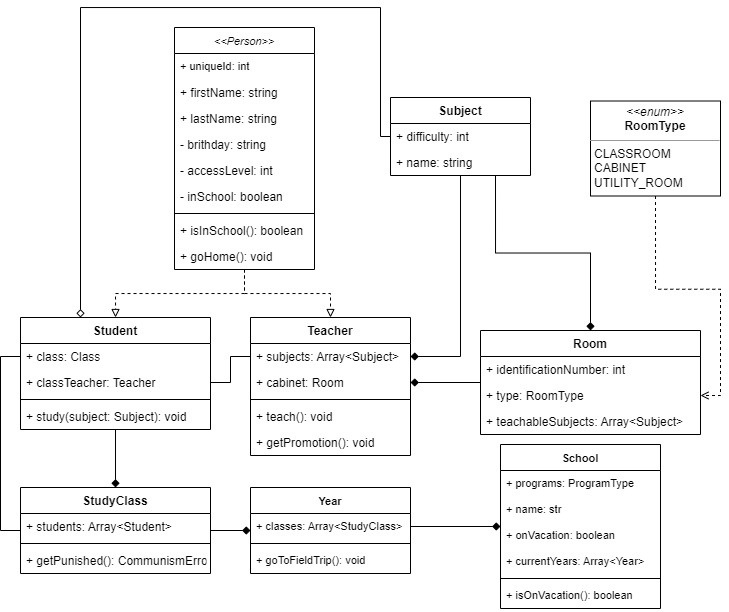

# Domácí Úkol #1
### Napiš třídy a jejich dědičnost, propojení a využití pro:  

- Person (Člověk)
- Student (Student)
- Teacher (Učitel)
- Subject (Předmět)
- Class (Třída)
- Year (Ročník)
- School (Škola)

**Použij diagram, který domám v úterý / ve středu pro kontrolu a upřesnění jejich propojení.**
Nauč se UML z tohoto [videa](https://www.youtube.com/watch?v=UI6lqHOVHic): [https://www.youtube.com/watch?v=UI6lqHOVHic](https://www.youtube.com/watch?v=UI6lqHOVHic)

**Diagram**  


## Dědičnost
Dedičnost je vlastnost objektově orientovaných jazyků, která umožňuje přesnějším třídám využívat vlastností a funkcí tříd z vyšších abstrakcí.
  
### Typy dědičnosti
- Dědění - Příjmáš vlastnosti rodiče, které se budou používat tak jak je využívá rodič (inherits)
- Rozšiřování - Příjmáš vlastnosti rodiče a přidáváš k nim nějaké specifické využití nebo je přepisuješ, závislost na volání constructoru rodiče (extends)
- Implementování - Vše je nadefinované v interfacu / abstraktní třídě a ty se staráš pouze o implementaci (inmplements)

**Dědičnost v jazyce C# je velice specifická.**

```cs
// ------------------
// ----- Dědění -----
// ------------------
class A {
    public string name;
    
    public void action() {
        Console.Write("action")
    }
}

class B: A {
    // už obsahuje public name: string a metodu action
    public void printName() {
        Console.WriteLine(name);    
    }
}

// -----------------
// -- Rozšiřování --
// -----------------
class A {
    string attr1
    public A(string inAttr1) {
            attr1 = inAttr1;
    }
}

class B: A {
    public B(int inAttr1, string inAttr2): base(inAttr2) {
        Console.WriteLine(inAttr1);
    }
    
    public void writeAttr1() {
        Console.WriteLine(attr1);
    }
}

// ------------------
// -- Implementace --
// ------------------
interface A {
    string attr1;
    
    public void call();
}

class B: A {
    public B(string inAttr1) {
        attr1 = inAttr1;
    }
    
    public void call() {
        Console.WriteLine(attr1);
    }
    
}

```

